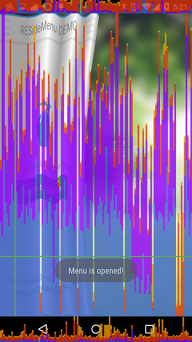

title: Performance update for Folder-ResideMenu
date: 2015-06-14 23:42:20
tags:
---
#Performance Update for Folder-ResideMenu

Folder-ResideMenu的核心部分算完成了,剩下的就是修复一些bug,于是我顺便做了下性能测试
结果如下:

WTF??!!

目测单帧 50ms左右.

好吧,于是我给自己开了个issue并且着手修复这个问题.

[https://github.com/dkmeteor/Folder-ResideMenu/issues/3](https://github.com/dkmeteor/Folder-ResideMenu/issues/3)

恩,这一定是个bug..

---
- 首先观察一下Logcat , 没有任何异常输出
- 看一下Memory monitor , 额...内存抖动....

    public float[] createOffsetVerts(float offset, float pointerY) {
        applyCurveXEffect(offset);
        applyScaleXEffect(offset, pointerY);
        mShader = applyShadow(offset);
        return meshVerts;
    }

算法核心在这里,一开始设计的时候就将效果分解成若干步了,正好可以分开一个一个调试.

因为公式太复杂了,写在一起 代码->公式 脑子里映射不出来,改起来太吃力,否则在一个循环里把verts都算好性能更好,不过那样就完全没有可读性了,至少我自己是看不懂了...

分别把每个步骤注释了再运行一下试试.
(虽然看到内存抖动的时候就想到大概是BitmapShader的问题了)

可以看到,干掉Shader以后,性能获得了无与伦比的提示

目测提升了10倍吧...单帧在4ms左右...
Shader就是扭曲效果之上渲染的阴影,发个对比图比较直观

阴影的Alpha会随着滑动不断加深来模拟褶皱越来越深的效果

无Shader                                                                  有Shader

找到关键点以后事情就变得简单了

生成Shader的代码

    private Shader applyShadow(float offset) {
    
        float p1 = (float) Math.sqrt(Math.PI / 2 * SIN_lENGTH_FACTOR);
        float p2 = (float) Math.sqrt((Math.PI / 2 + 1 * Math.PI) * SIN_lENGTH_FACTOR);
        float p3 = (float) Math.sqrt((Math.PI / 2 + 2 * Math.PI) * SIN_lENGTH_FACTOR);
        float p4 = (float) Math.sqrt((Math.PI / 2 + 3 * Math.PI) * SIN_lENGTH_FACTOR);
        float p5 = (float) Math.sqrt((Math.PI / 2 + 4 * Math.PI) * SIN_lENGTH_FACTOR);
        float p6 = (float) Math.sqrt((Math.PI / 2 + 5 * Math.PI) * SIN_lENGTH_FACTOR);
        float p7 = (float) Math.sqrt((Math.PI / 2 + 6 * Math.PI) * SIN_lENGTH_FACTOR);
        float p8 = (float) Math.sqrt((Math.PI / 2 + 7 * Math.PI) * SIN_lENGTH_FACTOR);
        float p9 = (float) Math.sqrt((Math.PI / 2 + 8 * Math.PI) * SIN_lENGTH_FACTOR);
    
        int gray = ((int) (mAlpha * ((1l - offset) * 1f)) << 24)
                | GRAY;
        Shader shader = null;
    
        if (mDirection == TouchDisableView.DIRECTION_RIGHT) {
            shader = new LinearGradient(0, 0, width, 0, new int[]{gray,
                    TRANSPARENT, gray, TRANSPARENT, gray, TRANSPARENT, gray,
                    TRANSPARENT, gray}, new float[]{p1 / width, p2 / width,
                    p3 / width, p4 / width, p5 / width, p6 / width, p7 / width,
                    p8 / width, p9 / width}, Shader.TileMode.REPEAT);
        } else {
            shader = new LinearGradient(0, 0, width, 0, new int[]{gray,
                    TRANSPARENT, gray, TRANSPARENT, gray, TRANSPARENT, gray,
                    TRANSPARENT, gray}, new float[]{(1 - p9 / width), (1 - p8 / width),
                    (1 - p7 / width), (1 - p6 / width), (1 - p5 / width), (1 - p4 / width), (1 - p3 / width),
                    (1 - p2 / width), (1 - p1 / width)}, Shader.TileMode.REPEAT);
        }
        return shader;
    }

看起来有些小问题,每次回调的时候会根据offset值重新计算 Shader的颜色(Alpha)
每次setFolder回调都会new出一个新的 `LinearGradient` 对象

上面一大堆常量可以扔出去,不用每次都计算

但是都不像是会引起内存抖动的问题. 'LinearGradient'这个对象并不大,即使每帧都new一个,也不会产生肉眼可见的内存抖动...

不过也可以优化一下,显然,更新Shader只是为了调整阴影的透明度,这工作扔到paint上做就好了

修改为每次 `setDirection` 时,将mShader设置为null

然后

    if (mShader == null)
        mShader = applyShadow(offset);

将ShaderAlpha移到MeshImageView中.由Paint去处理Shadow层的alpha问题.

再顺着Shader找找Shader处理阴影层的地方

    @Override
    public void draw(Canvas canvas) {
        super.draw(canvas);
        if (mPaint == null)
            mPaint = new Paint();
    
        if (mShader != null) {
            mShaderBitmap = Bitmap.createBitmap(canvas.getWidth(),
                    canvas.getHeight(), Bitmap.Config.ARGB_8888);
            Canvas tempCanvas = new Canvas(mShaderBitmap);
            Paint paint = new Paint();
            paint.setShader(mShader);
            paint.setAlpha((int)(mShaderAlpha * 255f));
            tempCanvas.drawPaint(paint);
        }
        if (mVerts != null) {
            canvas.drawBitmapMesh(mBitmap, 50, 5, mVerts, 0, null, 0, null);
            if (mShaderBitmap != null)
                canvas.drawBitmapMesh(mShaderBitmap, 50, 5, mVerts, 0, null, 0,
                        null);
        } else
            canvas.drawBitmap(mBitmap, new Matrix(), mPaint);
    }

Shit , 竟然在draw里去生成Bitmap......看来内存抖动就是它了....
仔细回忆了一下...我也想不起来当初为什么这么写了...可能只是为了更新阴影状态??
(无论任何时候,你看你三个月前写的代码,都觉得是一坨狗屎)
修改后如下

    @Override
    public void draw(Canvas canvas) {
        super.draw(canvas);
        if (mPaint == null)
            mPaint = new Paint();
    
        if (mShader != null && mShaderBitmap == null) {
            mShaderBitmap = Bitmap.createBitmap(canvas.getWidth(),
                    canvas.getHeight(), Bitmap.Config.ARGB_8888);
            Canvas tempCanvas = new Canvas(mShaderBitmap);
            Paint paint = new Paint();
            paint.setShader(mShader);
            tempCanvas.drawPaint(paint);
        }
        if (mVerts != null) {
            canvas.drawBitmapMesh(mBitmap, 50, 5, mVerts, 0, null, 0, null);
            if (mShaderBitmap != null) {
                mAlphaPaint.setAlpha((int) (mShaderAlpha * 255f));
                canvas.drawBitmapMesh(mShaderBitmap, 50, 5, mVerts, 0, null, 0,
                        mAlphaPaint);
            }
        } else
            canvas.drawBitmap(mBitmap, new Matrix(), mPaint);
    }

tempCanvas只会创建一次,看来仍在这里也没什么问题

再跑起来看一下

哦哦 看起来非常不错了.....

对比一下QQ

当然QQ整个View比我这个Demo复杂的多,光View层级就得复杂个几十倍把,
不过这锯齿形的帧率也很奇怪..

但是我注意到....我的有2帧绘制的非常慢? 看起来像是坏点?
What is that?

反复操作了几次以后发现,那个长条就是缩放动画开始的第一帧...
让我想想第一帧之前做了什么? 截取当前View生成Bitmap
把当前ContentView偷偷换成了Bitmap截图
当然,根据优化后的代码,还生成了一个ShaderBitmap

ok

下一步来研究这个问题...

---

首先可以想到,最容易造成新能问题的,自然就是 Bitmap生成了
还记得上面做的Shader优化的话
我们会在 动画触发 的时候

生成一个 BitmapShader

简单的添加了个log

05-28 16:23:03.908    4153-4153/com.dk.sample.folder.residemenu I/System.out﹕ CreateShader:34

大约在25~35ms左右
这样的话 这一帧渲染时间当然一定会超过16ms了...

仔细思考一下这个系统,我其实只需要2个方向的不同Shader
那么预先把他们生成好并cache起来,就不必再ondraw时再去生成了

